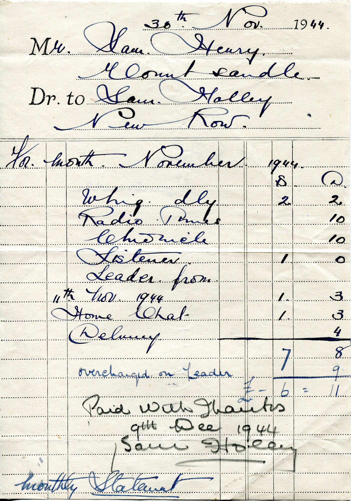
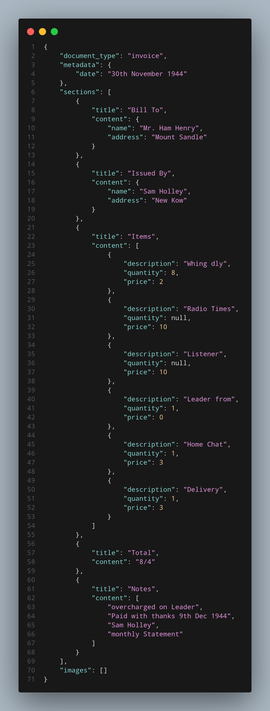
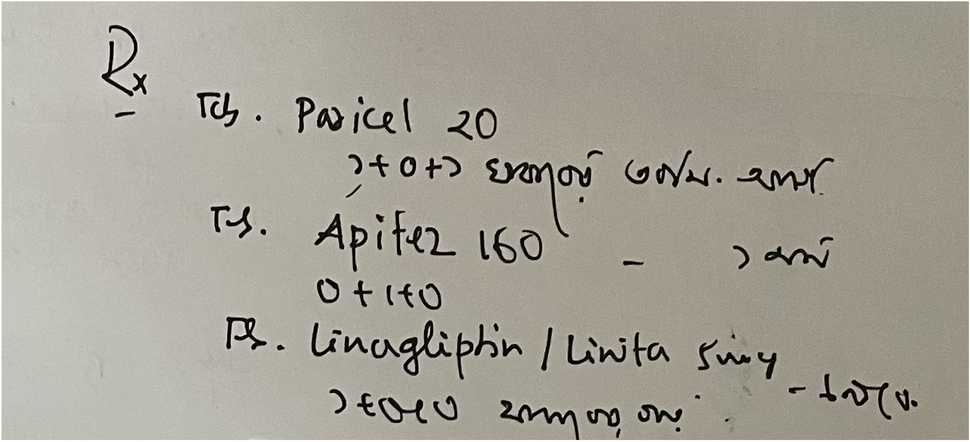
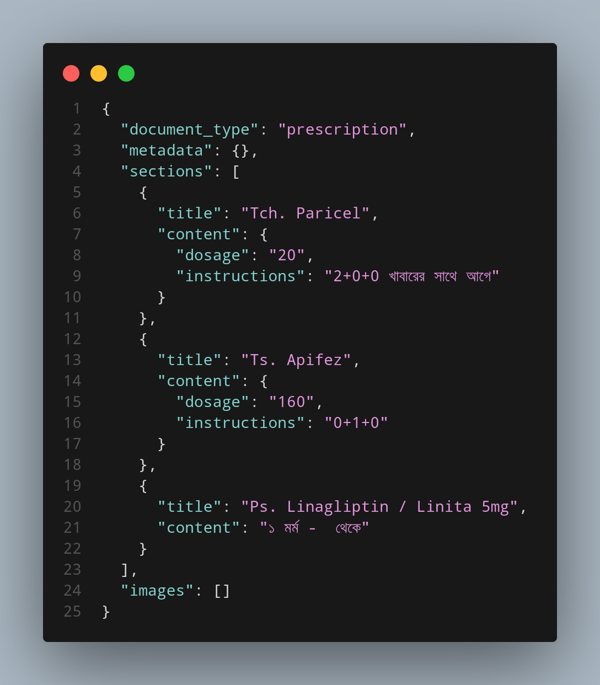
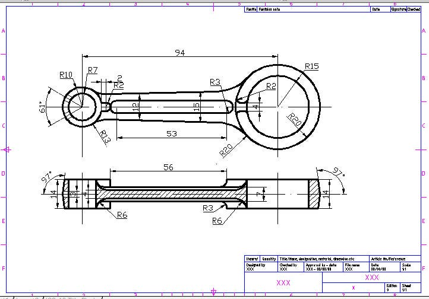
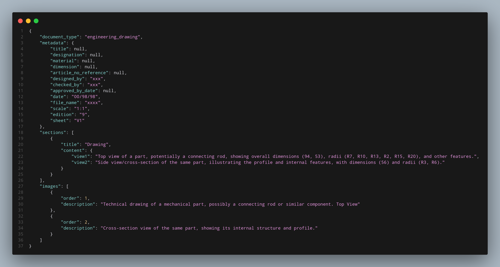
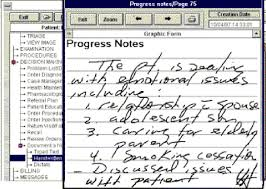
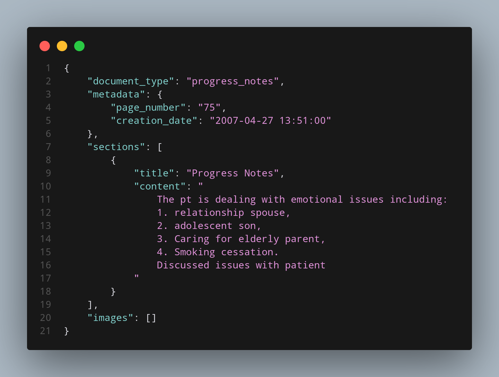

**T-Parser**
========================

A cutting-edge document parsing application that leverages the power of Google Gemini Vision and LLaMA 3.3 from Groq to extract valuable insights from your documents.

[Watch a demo video of T-Parser in action](https://youtu.be/3o7txPbc2aw)

**Overview**
------------

T-Parser is designed to simplify the process of extracting relevant information from PDF and image files. By harnessing the capabilities of Google Gemini Vision and LLaMA 3.3 from Groq, our application can accurately analyze document images and parse the content into a structured JSON format. Whether you have invoices, ID cards, medical handwritten transcripts, engineering drawings, reports, or any other type of document, T-Parser can handle it with ease.

**Key Features**
------------

*   **Multi-Format Support**: T-Parser can handle a wide range of file formats, including PDF, PNG, JPG, JPEG, BMP, and GIF.
*   **Comprehensive Extraction**: Our application can extract document type, metadata, sections, and images, providing a complete understanding of your documents.
*   **Advanced Parsing**: T-Parser utilizes Google Gemini Vision for document image analysis and LLaMA 3.3 from Groq for parsing, ensuring accurate and reliable results. Our application is particularly effective at parsing handwritten documents, including those with complex layouts and cursive writing.
*   **JSON Output**: The parsed document is returned in JSON format, making it easy to integrate with your existing workflows.

**Demo Images**
-------------

Here are some examples of documents that T-Parser can parse:

*   Invoice:  
*   Medical Handwritten Transcript:  
*   Engineering Drawing:  
*   Progress Note:  

**Getting Started**
------------

To start using T-Parser, follow these simple steps:

1.  Clone the repository: `git clone https://github.com/Talha-Ali-5365/T-Parser.git`
2.  Install the required libraries: `pip install -r requirements.txt`
3.  Set up your Google Gemini Vision API key: `export GOOGLE_API_KEY=YOUR_API_KEY`
4.  Set up your GROQ API key: `export GROQ_API_KEY=YOUR_API_KEY`
5.  Launch the application: `streamlit run app.py`

**Using T-Parser**
-----

1.  Upload your PDF or image file using the file uploader.
2.  T-Parser will process the file and display the parsed document in JSON format.

**Code Organization**
-----------------

This codebase is structured into the following files:

*   `init.py`: Initializes the application, including setting up logging and loading the LLaMA 3.3 model.
*   `app.py`: The main Streamlit application file.
*   `config.py`: Configuration file for the application.
*   `constants.py`: Constants used throughout the application.
*   `t_parser.py`: The document parser function using Google's Generative AI and Langchain's ChatGroq model.

**Contributing**
------------

We welcome contributions to T-Parser! If you're interested in contributing, please fork the repository and submit a pull request.

**License**
-------

T-Parser is licensed under the MIT License. See `LICENSE` for details.